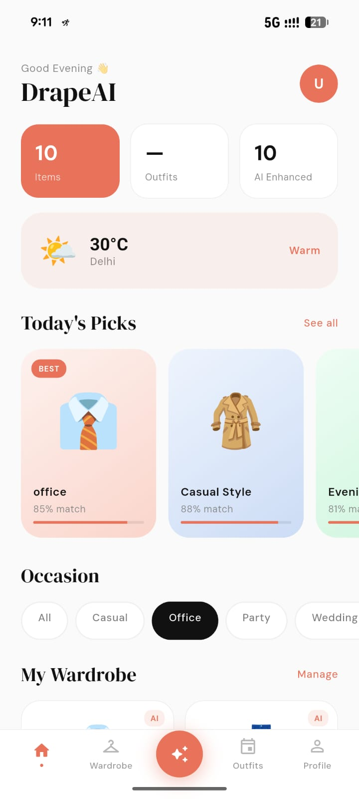
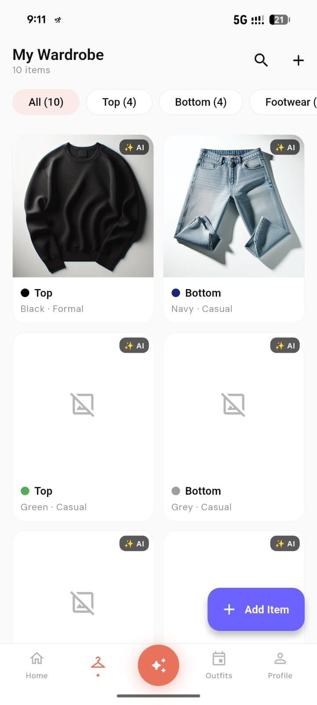
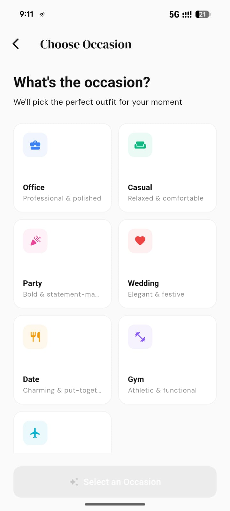

# 👗 DrapeAI — Your AI Personal Stylist

> An AI-powered mobile app that helps you decide what to wear — using your own wardrobe, your style, and real-time weather.

---
## 📸 App Screenshots

<p align="center">
  
  
  
</p>

---
## 🚀 Overview

Most people don’t lack clothes — they lack **clarity**.

Every morning:

* “What should I wear?”
* “Does this match?”
* “Is this okay for the weather?”

**DrapeAI** solves this by turning your wardrobe into a **smart, AI-powered recommendation system**.

👉 No shopping.
👉 No guessing.
👉 Just better decisions using what you already own.

---

## 🎯 Core Idea

1. 📸 Digitize your wardrobe
2. 🧠 Understand your style
3. 🌦 Combine with weather + occasion
4. 👗 Generate a complete outfit

---

## ✨ Key Features

### 👕 Wardrobe Digitization

* Upload clothing images (camera/gallery)
* AI extracts:

  * Category (top, bottom, footwear)
  * Color, pattern, style
  * Fabric & season suitability
* Images optimized using Cloudinary

---

### 🧠 Smart Outfit Recommendations

* Full outfit generation:

  * Top + Bottom + Footwear
* Based on:

  * Occasion (Office, Casual, Party, etc.)
  * Weather conditions
  * Personal style

---

### 🌦 Weather-Aware Styling

* Real-time weather integration (OpenWeatherMap)
* Adjusts outfit based on:

  * Temperature
  * Rain conditions
  * Season

---

### 🎨 Hybrid Intelligence Engine (IMPORTANT)

Unlike typical AI apps:

👉 DrapeAI uses **Rules + AI**

* Rule-based system:

  * Color compatibility
  * Occasion filtering
  * Weather constraints

* AI layer:

  * Missing attribute detection
  * Style suggestions
  * Outfit explanation

👉 Result: **Fast, reliable, and explainable recommendations**

---

### 🔐 Authentication & Security

* Phone OTP login (Firebase)
* JWT-based sessions
* Secure storage (Keystore / Keychain)

---

### 📱 Mobile-First Experience

* Built with Flutter
* Cross-platform (Android + iOS + Web)
* Smooth, responsive UI

---

## 🏗 System Architecture

```text
User (Mobile App - Flutter)
        │
        ▼
FastAPI Backend
        │
 ┌──────┼──────────────┐
 │      │              │
 ▼      ▼              ▼
MongoDB  Redis      Cloudinary
(User data) (Cache)  (Images)
        │
        ▼
AI Layer (OpenAI GPT-4o Vision)
        │
        ▼
Recommendation Engine (Rules + Scoring)
        │
        ▼
Outfit Response → Mobile App
```

---

## ⚙️ Tech Stack

### 📱 Mobile

* Flutter (Dart)
* Riverpod (State Management)

---

### 🧠 AI / ML

* OpenAI GPT-4o (Vision + reasoning)
* Rule-based recommendation engine
* Color compatibility scoring

---

### 🖥 Backend

* FastAPI (Python)
* MongoDB (wardrobe + user data)
* Redis (caching recommendations)

---

### ☁️ Infrastructure

* Cloudinary (image storage + optimization)
* Firebase (OTP authentication)
* Render (deployment)
* OpenWeatherMap API (weather data)

---

## 🧠 System Design Highlights

### 1. Hybrid Recommendation Engine

* Rules handle deterministic logic
* AI fills gaps and adds intelligence

👉 Avoids hallucination + improves reliability

---

### 2. Weather as a First-Class Input

* Not optional — **core decision factor**
* Influences filtering and scoring

---

### 3. Real User Data (Not Generic AI)

* Uses **your actual wardrobe**
* No external fashion dataset dependency

---

### 4. Caching for Performance

* Daily outfit cached (Redis)
* Reduces API calls + improves speed

---

## 📦 Local Setup

```bash
# Clone repo
git clone https://github.com/n2coder/drapeAI.git
cd drapeAI

# Setup environment
cp .env.example .env

# Run backend
uvicorn app.main:app --reload

# Run Flutter app
flutter pub get
flutter run
```

---

## 🎯 Example Use Cases

* “What should I wear to office today?”
* “Suggest outfit for a wedding”
* “What works in rainy weather?”
* “Match something with this shirt”

---

## 🔥 Why This Project Stands Out

* Not e-commerce → **your wardrobe only**
* Not generic AI → **personalized recommendations**
* Not pure AI → **hybrid rule + AI system**
* Not backend-only → **full mobile product**

---

## 🔮 Roadmap

* Outfit history & calendar
* AI style learning (user feedback loop)
* Body type & skin tone personalization
* Social sharing (Instagram-ready outfits)
* Smart wardrobe gap detection

---

## 🧠 Engineering Philosophy

> Build AI systems that are:
>
> * Reliable (rules where needed)
> * Personalized (user-first data)
> * Practical (real daily use)

---

## 📬 Contact

**Naresh Chaudhary**
📧 [n26code@gmail.com](mailto:n26code@gmail.com)
🔗 https://github.com/n2coder

---

⭐ If you like this project, give it a star — or try building your own AI stylist.
